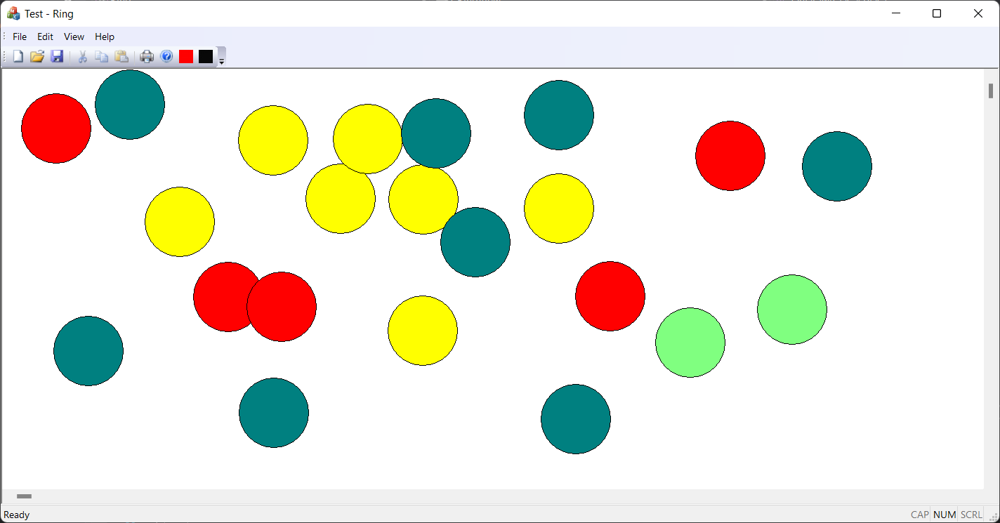
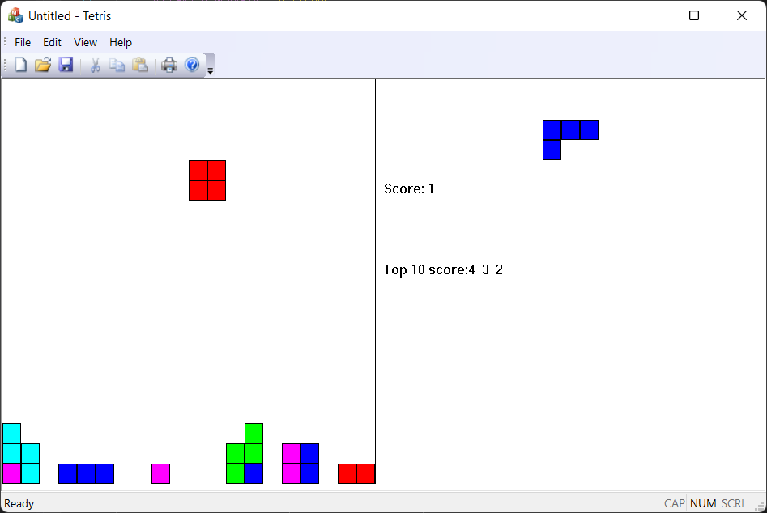

# WindowsApplicationByExample

该项目主要是为了加深Windows系统的消息机制，Windows应用程序的常用功能（如保存，键盘，绘制界面等）。学习书籍为《Microsoft Visual C++ Windows Applications By Example》（Stefan Bjornander）。该书我觉得很浅显易懂，前部分章节回顾了一些C++的基础知识，后面则以实际的MFC例子进行软件的搭建和讲解，主要例子有：**

## Ring



该应用实现了在窗口中绘制圆形的功能，其中包含相关：

1. 鼠标消息
2. 序列化对象来保存绘制图形数据
3. 通过操作注册表来记录上一次画笔的颜色
4. 操作菜单栏来增加新的功能
5. 添加滑动条来增加视窗
6. 通过画盘来选择画笔颜色

### 重点

1. 记录每个圆的圆心坐标和颜色，每一次都进行重绘

```c++
void CRingView::OnDraw(CDC* pDC/*pDC*/)
{
	CRingDoc* pDoc = GetDocument();
	ASSERT_VALID(pDoc);
	if (!pDoc)
		return;

	// TODO: add draw code for native data here
	PointArray& pointArray = pDoc->GetPointArray();
	ColorArray& colorArray = pDoc->GetColorArray();

	int iSize = (int)pointArray.GetSize();
	for (int i = 0; i < iSize; i++)
	{
		CPoint point = pointArray[i];
		COLORREF color = colorArray[i];

		CPen pen(PS_SOLID, 0, BLACK);
		CBrush brush(color);

		CPen* pOldPen = pDC->SelectObject(&pen);
		CBrush* pOldBrush = pDC->SelectObject(&brush);

		pDC->Ellipse(point.x - RADIUS, point.y - RADIUS, point.x + RADIUS, point.y + RADIUS);

	}
}
```

2. 键盘消息绑定视图调整

```c++
void CRingView::OnKeyDown(UINT nChar, UINT nRepCnt, UINT nFlags)
{
	switch (nChar)
	{
	case VK_UP:
		OnVScroll(SB_LINEUP, 0, NULL);
		break;
	case VK_DOWN:
		OnVScroll(SB_LINEDOWN, 0, NULL);
		break;
	case VK_PRIOR:
		OnVScroll(SB_PAGEUP, 0, NULL);
		break;
	case VK_NEXT:
		OnVScroll(SB_PAGEDOWN, 0, NULL);
		break;
	case VK_LEFT:
		OnHScroll(SB_LINELEFT, 0, NULL);
		break;
	case VK_RIGHT:
		OnHScroll(SB_LINERIGHT, 0, NULL);
		break;
	case VK_HOME:
		OnHScroll(SB_LEFT, 0, NULL);	
		break;
	case VK_END:
		OnHScroll(SB_RIGHT, 0, NULL);
		break;
	default:
		break;
	}
}
```

3.序列化保存

```c++
void CRingDoc::Serialize(CArchive& ar)
{
	m_colorArray.Serialize(ar);
	m_pointArray.Serialize(ar);

	if (ar.IsStoring())
	{
		// TODO: add storing code here
		ar << m_nextColor; //to store << extraction
	}
	else
	{
		// TODO: add loading code here
		ar >> m_nextColor; //to load >> insertion
	}
}

```

4. 注册表记录上一次操作的画笔颜色

```c++
CRingDoc::CRingDoc() noexcept
{
	// TODO: add one-time construction code here
	m_nextColor = AfxGetApp()->GetProfileInt(_T("Ring"), _T("Color"), WHITE);

}

CRingDoc::~CRingDoc()
{
	AfxGetApp()->WriteProfileInt(_T("Ring"), _T("Color"), m_nextColor);
}
```

## Tetris

该应用主要实现了一个俄罗斯方块的小游戏。



### 实现

#### 类分析

游戏中主要有背景网格，网格上有方块，4个方块构成的图形。

而根据MFC项目框架，只需要改变TetirsDoc、TetrisView，分别用来记录背景网格、图形的位置颜色信息和显示数据的界面。

#### 实现

1. 定义背景网格

定义了20Row * 20Col的网格，每个网格是COLORREF的数组，可以获取和设置每个网格的颜色。

2. 定义方块

一个方块其实就是一个网格，方块组成移动的图形。

3. 七种图形

每个图形由四个方块组成，通过定义中心坐标方块（0，0），和其他方块的相对坐标，来标识每一个图形。

并且通过一个图形数组来记录不同旋转方向的图形的信息。

```c
/*
  #*  #
  #   #
*/
SquareArray RedGeneric = { Square(0,0), Square(0, 1), 
						   Square(1, 0), Square(1, 1) };
SquareInfo RedInfo = { &RedGeneric, &RedGeneric,
					  &RedGeneric, &RedGeneric };

/*
	#
	#*
	#
	#
*/
SquareArray BrownVertical = { Square(0,0), Square(-1, 0),
						   Square(1, 0), Square(2, 0) };
SquareArray BrownHorizontal = { Square(0,0), Square(0, -1),
						   Square(0, 1), Square(0, 2) };
SquareInfo BrownInfo = { &BrownVertical, &BrownHorizontal,
						&BrownVertical, &BrownHorizontal };

/*
	#
	# * #
	    #
*/
SquareArray TurquoiseVertical = { Square(0,0), Square(-1, 0),
						   Square(0, 1), Square(1, 1) };
SquareArray TurquoiseHorizontal = { Square(0,0), Square(0, 1),
						   Square(1, 0), Square(1, -1) };
SquareInfo TurquoiseInfo = { &TurquoiseVertical, &TurquoiseHorizontal,
							&TurquoiseVertical, &TurquoiseHorizontal };

/*
		#
	#	#*
	#
*/
SquareArray GreenVertical = { Square(0,0), Square(-1, 0),
						   Square(1, -1), Square(0, -1) };
SquareArray GreenHorizontal = { Square(0,0), Square(-1, 0),
						   Square(0, 1), Square(-1, -1) };
SquareInfo GreenInfo = { &GreenVertical, &GreenHorizontal,
							&GreenVertical, &GreenHorizontal };

/*
	 #
  #  #*  #
*/
SquareArray YellowNorth = { Square(0,0), Square(-1, 0),
						   Square(0, 1), Square(0, -1) };
SquareArray YellowEast = { Square(0,0), Square(-1, 0),
						   Square(0, 1), Square(1, 0) };
SquareArray YellowSouth = { Square(0,0), Square(0, 1),
						   Square(1, 0), Square(0, -1) };
SquareArray YellowWest = { Square(0,0), Square(-1, 0),
						   Square(1, 0), Square(0, -1) };
SquareInfo YellowInfo = { &YellowNorth, &YellowEast,
					  &YellowSouth, &YellowWest };

/*
		#
#	#*	#
*/
SquareArray BlueNorth = { Square(0,0), Square(-1, 1),
						   Square(0, 1), Square(0, -1) };
SquareArray BlueEast = { Square(0,0), Square(-1, 0),
						   Square(1, 0), Square(1, 1) };
SquareArray BlueSouth = { Square(0,0), Square(0, 1),
						   Square(0, -1), Square(1, -1) };
SquareArray BlueWest = { Square(0,0), Square(-1, 0),
						   Square(-1, -1), Square(1, 0) };
SquareInfo BlueInfo = { &BlueNorth, &BlueEast,
					  &BlueSouth, &BlueWest };

/*
#
#	#*	#
*/
SquareArray PurpleNorth = { Square(0,0), Square(-1, -1),
						   Square(0, -1), Square(0, 1) };
SquareArray PurpleEast = { Square(0,0), Square(-1, 0),
						   Square(-1, 1), Square(1, 0) };
SquareArray PurpleSouth = { Square(0,0), Square(0, 1),
						   Square(1, 1), Square(0, -1)};
SquareArray PurpleWest = { Square(0,0), Square(-1, 0),
						   Square(1, 0), Square(1, -1) };
SquareInfo PurpleInfo = { &PurpleNorth, &PurpleEast,
					  &PurpleSouth, &PurpleWest };


```

4. 未完成区域刷新，现在的是全局刷新，结束游戏时ColorGrid全局变暗

## 
